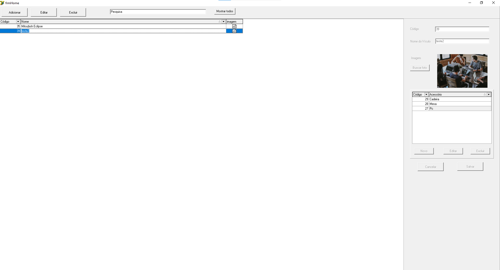

# os24275

## Descrição
Este projeto visa criar um sistema de cadastro de veículos e seus respectivos acessórios, 
proporcionando uma interface intuitiva para adição, edição e exclusão de informações. 
O sistema é desenvolvido em Delphi, utilizando um banco de dados relacional para armazenar os dados de forma persistente.

### Status
Concluído

### Features

- [x] Adicionar Veiculos
- [x] Editar Veículos
- [x] Excluir Veículos
- [x] pesquisar veículos
- [x] Adicionar acessório
- [x] Editar
- [x] Excluir

### Técnologias usadas

- [Delphi 7](https://www.embarcadero.com/br/products/delphi/starter)
- [firebird](https://www.firebirdsql.org/)

### Autor
---
 

<h3>Vinícius de Araujo Goulart</h3>

<h2>Feito com ❤️ por Vinícius Goular 👋🏽 Entre em contato!</h2>

[LinkedIn](https://www.linkedin.com/in/goulart-vinicius)

